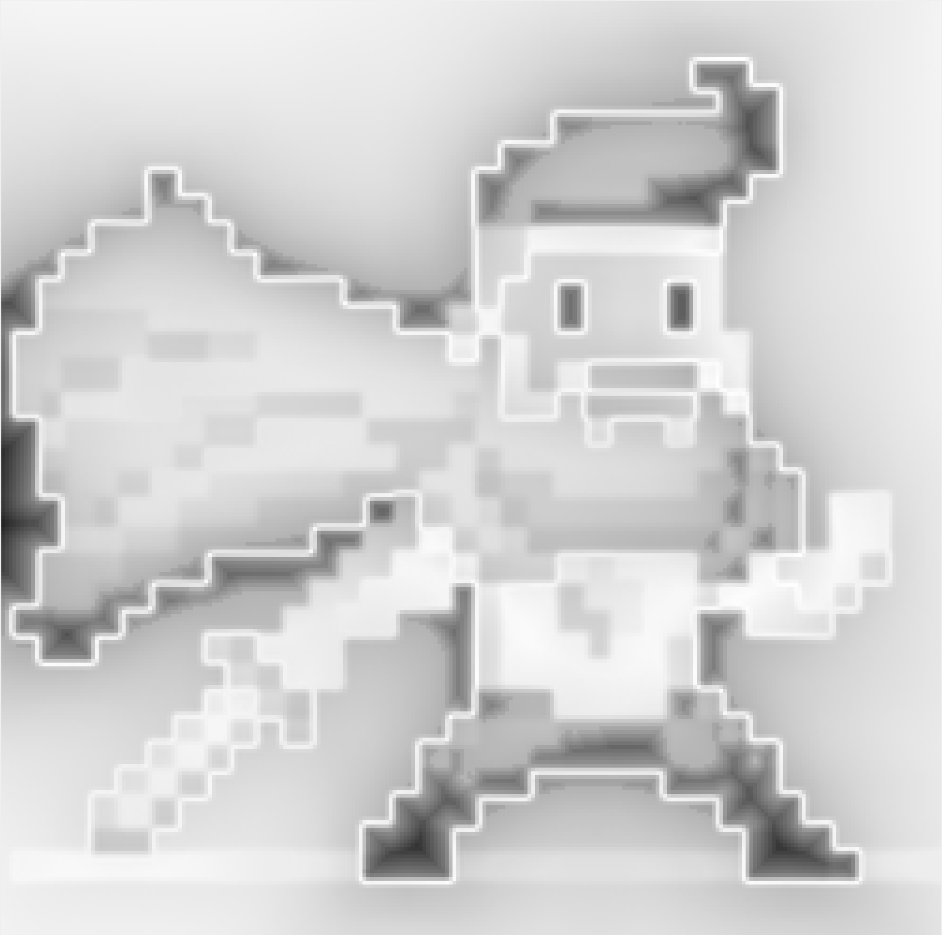

# Image Segmentation

This project implements the Ford-Fulkerson algorithm in conjunction with a saliency map to extract objects from images using graph-based methods.

## Methodology

The segmentation problem is treated as a flow network, with the following structure:

- **Nodes**: Each pixel in the image is treated as a node in the graph.
- **Additional Nodes**: Two additional nodes are added:
  - **Source (S)**: Represents the foreground region.
  - **Sink (T)**: Represents the background region.
- **Edges**: 
  - Each pixel has directed edges to its four adjacent neighbors.
  - The source (S) and sink (T) have directed edges to all pixel nodes.
- **Weights**:
  - The weight between two edges is low if the corresponding pixels are similar, facilitating accurate segmentation.
  - The weight between pixels and the source/sink (S/T) represents the probability of the pixel belonging to the foreground or background, derived from a saliency map.

By applying the Ford-Fulkerson algorithm, the minimum cut is determined. Nodes reachable from the source (S) are classified as foreground, while those connected to the sink (T) are classified as background.

A crucial part of this procedure is estimating the probabilities of the pixels belonging to foreground or background. Many research papers assume some prior information that's used to calculate the probabilites. However, I wanted to calculate them with just the image alone. To do this, there are several approaches that were implemented:
 - Gaussian Mixture Model
   - models the colour distribution of pixel values as a mixture of multiple Gaussian distribution
   - works well for high resolution/complex images
 - Saliency Map
   - identifies regions that stand out e.g. edges
   - provides accurate probabilities for the boundary pixels of objects, but less so for the pixels inside the object 
 - Saliency Map with Region Growing
   - same as saliency map but combined with region growing which expands the highlighted regions from the map
   - in many cases, expands in wrong areas 

After testing each out for sample images, GMMs worked the best. Here are some examples (in order):




## How to Run
### Program

To compile and run the program, follow these steps:

1. Open your terminal and navigate to the project directory.
2. Compile with the following command:

   ```bash
   g++ -g -o final main.cpp ImgSegModel.cpp Graph.cpp `pkg-config --cflags --libs opencv4`
   ```

This command compiles all the source files and generates and executable file called 'final'.

  ```bash
     ./final "pathToInputImage" ["pathToOutputImage"]```
  ```
### Arguments

- **pathToInputImage**:
  - path to the input image file that's being segmented
- **pathToOutpuImage**:
  - path to file where the resulting image is saved
  - if this argument is left out, the result is saved as "img.png" in the current directory

There is an existing "cross.png" image in the current directory that can be tested upon.
 
### Example Usage

  ```bash
    ./final "cross.png" "output.png"
  ```

### Tests

Similarly to above, open terminal and navigate to the project directory. Then, run the following command:

  ```bash
   g++ -g -o test TestGraph.cpp Graph.cpp -lgtest -lgtest_main -pthread
   ```

Running the created executable on its own will run all the tests.
To run a single testcase, add the following argument to the executable:

  ```bash
   ./test --gtest_filter=TestSuiteName.TestCaseName
   ```

You can also add a check with valgrind simultaneously by adding a second operation when compiling:

  ```bash
   g++ -g -o test TestGraph.cpp Graph.cpp -lgtest -lgtest_main -pthread && valgrind --leak-check=full
   ```


